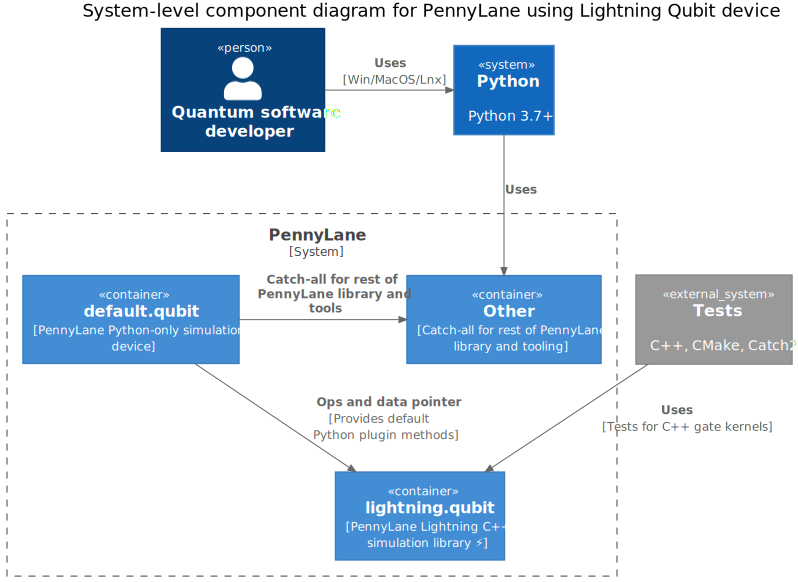

Architecture overview
=====================

.. |br| raw:: html

    

Lightning's purpose is to provide direct C++ kernels to manipulate the statevector data as created with PennyLane. Our design extends that of the "default.qubit" device in PennyLane, allowing direct access to the complex C-backed Numpy array data. This ensures we maintain all existing compatibility with PennyLane plugins, as only the gate-application is offloaded to C++.

The following diagram represents the current architecture of Lightning using an adaption of the C4 container model.

|br|

|br|

To understand the relationships between PennyLane, Lightning, and its components, we also present a component-level diagram. 

|br|

.. image:: ../_static/arch/system_containers_components.svg
  :width: 600
  :alt: Example of a tensor network.
  :align: center

|br|

The interactions provided allow us to develop and extend functionality from PennyLane to Lightning, whilst providing a clear boundary between different parts of the system.