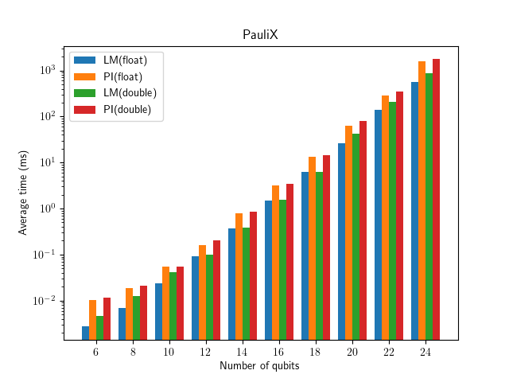
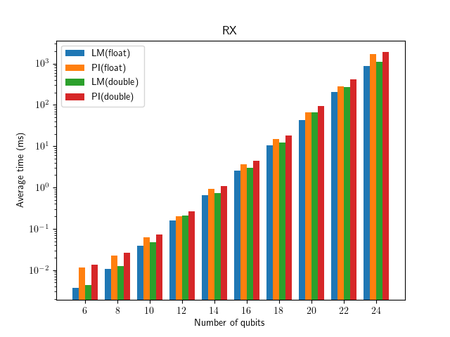

Benchmark different kernel implementations
##########################################

You can benchmark different gate implementations inside the project.

.. code-block:: console

    $ make gbenchmark
    $ cd BuildGBench

Then you can benchmark all gate operations in all kernels by running the script.

.. code-block:: console

    $ ./benchmarks/benchmark_all.sh

The results will be recorded in ``bench_result.json`` file.
You can then plot the results for a specific gate with

.. code-block:: console

    $ ./benchmarks/plot_gate_benchmark.py ./bench_result.json

It will create a plot for each gate operation comparing performance of kernels and floating point types. The plots can be found in ``plots`` subdirectory.

One can also choose a specific datatype by providing an option:

.. code-block:: console

    $ ./benchmarks/plot_gate_benchmark.py --precision float ./bench_result.json # Results for std::complex<float>
    $ ./benchmarks/plot_gate_benchmark.py --precision double ./bench_result.json # Results for std::complex<double>

Here are some example plots:

