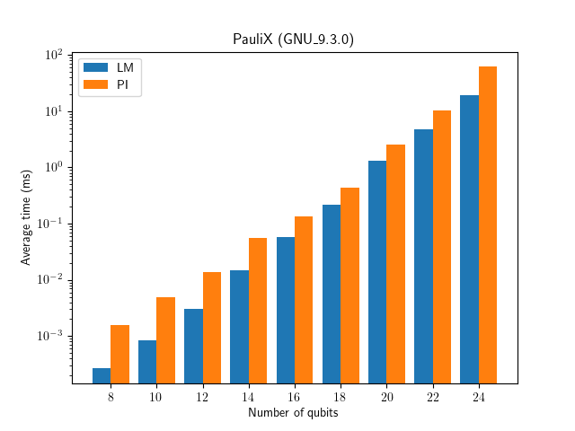
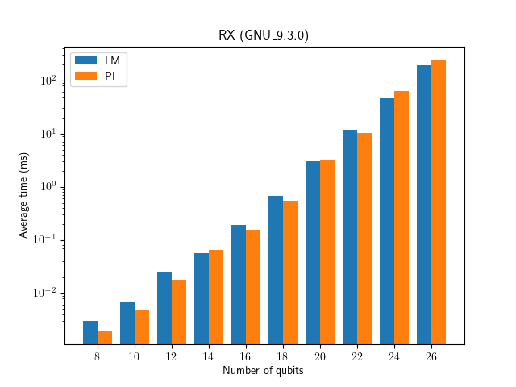

Benchmark different kernel implementations
##########################################

You can benchmark different gate implementations inside the project.

.. code-block:: console

    $ make benchmark
    $ cd BuildBench

Inside the directory, you can see ``run_gate_benchmark.sh``. You can benchmark a specific kernel implementation for a gate by providing arguments. 
For example, you can compare benchmark results for ``PauliX`` gate with ``KernelType::PI`` and ``KernelType::LM`` by running the following commands:

.. code-block:: console
   
    $ ./run_gate_benchmark.sh PI PauliX
    $ ./run_gate_benchmark.sh LM PauliX

The benchmark results will be written in ``res_{COMPILER}_{VERSION}`` subdirectory. For example, if you use GCC version 9.3.0, the directory name will be ``res_GNU_9.3.0``. 

You can then plot the results for a specific gate with 

.. code-block:: console
   
    $ ./plot_gate_benchmark res_GNU_9.3.0 PauliX

You should change the second argument to your result directory name. Example outputs are as below:

It shows the LM kernel is :math:`\sim 2` times faster for the PauliX gate (for all number of qubits :math:`N`) but is slightly slower for the RX gate when :math:`N \leq 22`.
